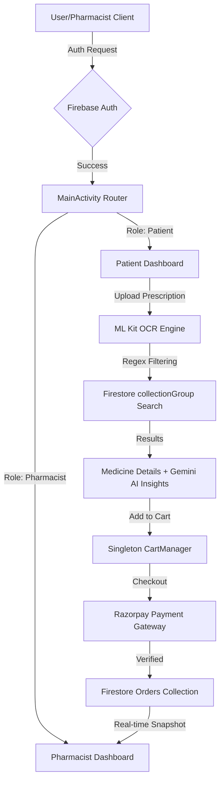

# 💊 Medi - Smart Pharmacy & Healthcare App

[](https://developer.android.com)
[](https://www.java.com)
[](https://firebase.google.com)
[](https://developers.google.com/ml-kit)
[](https://deepmind.google/technologies/gemini/)

**Medi** is a high-performance Android ecosystem that digitizes the pharmacy experience. It bridges the gap between healthcare providers and patients through AI-driven prescription parsing, Generative AI medical assistance, and a robust real-time supply chain management system.

---

## 🏗 System Architecture

The **Medi** ecosystem is built on a high-availability, cloud-synced architecture designed for real-time healthcare management.

### 1. Architectural Diagram (Logic Flow)


### 2. Layered Breakdown
*   **Presentation Layer**: Built with **Material Design 3** and **ViewBinding**. It utilizes a responsive Activity-based navigation system to ensure smooth transitions between complex tasks like OCR scanning and payment processing.
*   **Intelligence Layer (AI/ML)**: 
    *   **ML Kit Engine**: Handles edge-based text recognition to minimize latency.
    *   **Gemini AI Bridge**: Provides Generative AI context for drug interactions, acting as a virtual pharmacist for patients.
*   **Data & Persistence Layer**:
    *   **Reactive Backend**: Uses **Cloud Firestore** for real-time data streaming (orders/inventory).
    *   **Blob Storage**: **Firebase Storage** manages high-resolution prescription images and medicine catalogs.
    *   **State Management**: Implements the **Singleton Pattern** in `CartManager` to maintain a globally consistent state, preventing data loss during configuration changes (like screen rotation).

---

## 🔄 Technical Workflow & System Logic

### 1. Patient Procurement Workflow
1.  **Identity Verification**: `UserSignin.java` handles session persistence via Firebase Auth. Google One-Tap integration is implemented for low-friction onboarding.
2.  **Smart Prescription Analysis**: The image is processed via `Google ML Kit TextRecognizer`. Raw blocks of text are extracted, filtered via Regex (`[a-zA-Z]{4,}`), and queried against Firestore `collectionGroup` to find matches across all pharmacies simultaneously.
3.  **GenAI Assistance**: Integrated with the **Google Gemini API**, providing a chatbot-like interface where patients can query drug interactions, side effects, and general health advice.
4.  **Transaction Lifecycle**: Integrates **Razorpay SDK**. The workflow handles the `PaymentResultListener` callbacks; upon success, the cart is flushed and a new `Order` document is atomized into the database.

### 2. Supply Chain & Fulfillment (Pharmacist Logic)
1.  **Inventory Management**: `addmedicine.java` handles binary data upload (images) to **Firebase Storage** and metadata (price, dosage) to **Firestore**.
2.  **Real-Time Dashboard**: `OrdersReceivedActivity` uses a `SnapshotListener`. When a customer places an order, the pharmacist's UI updates instantly without requiring a refresh.

---

## 🛠 Tech Stack Implementation Details

| Component | Technology | Implementation Detail |
| :--- | :--- | :--- |
| **Language** | Java 11 | Utilizes modern Java features like Lambda expressions and Stream APIs. |
| **Backend** | Firebase | Firestore (DB), Auth (Identity), Storage (Images). |
| **AI/ML** | ML Kit & Gemini | OCR for prescriptions and GenAI for medical context. |
| **Payments** | Razorpay | End-to-end encrypted payment processing. |
| **Security** | jBCrypt | Salted password hashing for pharmacist accounts. |
| **Image Handling** | Glide | Efficient memory management and lazy-loading of thumbnails. |

---

## 📝 Detailed Project Summary (For CV/Portfolio)

**Medi** is a sophisticated healthcare and pharmacy management ecosystem designed to modernize the traditional medicine procurement process. By bridging the gap between patients and pharmacists, the application facilitates a seamless end-to-end digital workflow. Patients can utilize high-precision **AI-driven OCR** to scan physical prescriptions, which are automatically parsed and matched against a real-time, cross-pharmacy inventory powered by **Firebase Firestore**. To enhance the patient experience, the platform integrates **Generative AI (Google Gemini)**, providing a conversational interface for medical guidance, drug interaction checks, and health advice. 

The application's architecture emphasizes reliability and security, employing the **Singleton design pattern** for consistent state management across the shopping experience, **jBCrypt** for salted password hashing, and the **Razorpay SDK** for secure, encrypted financial transactions. This holistic approach ensures that Medi is not just a marketplace, but a high-performance healthcare companion that prioritizes speed, security, and intelligent automation.

---

## 🚀 Setup & Installation

1.  **Clone the Repository**:
    ```bash
    git clone https://github.com/parzival787/MEDI.git
    ```
2.  **Firebase Integration**:
    *   Place your `google-services.json` in the `app/` folder.
    *   Enable **Authentication**, **Cloud Firestore**, and **Storage**.
3.  **API Key Configuration**:
    *   Add your **Razorpay Key** in `PaymentActivity.java`.
    *   Inject your **Gemini API Key** into the AI helper module.
4.  **Build**: Open in Android Studio Ladybug (or newer), Sync Gradle, and Run.

---

## 🤝 Contributing
Contributions are welcome! Please submit a Pull Request.

**Developer**: [parzival787](https://github.com/parzival787)
